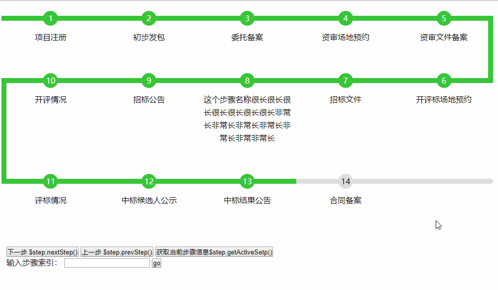

# show

## 小工具

- [自动监控编译sass](./tools/watch-and-render-sass/)
- [任意内容转化为base64](https://cdswyda.github.io/show/tools/anything2base64/)
- [html转义](https://cdswyda.github.io/show/tools/escape-html-character/)

## demo

- [chrome图标点击旋转效果](https://cdswyda.github.io/show/demo/chrome-rotate/)

- [网页文本朗读实现](https://cdswyda.github.io/show/demo/speaker/)

- [通过jQuery递延对象的then来进行传递](https://cdswyda.github.io/show/demo/jqueryPassOnByThen/test.html)

- [纯css实现菜单展开收起](https://cdswyda.github.io/show/demo/css-menu/menu.html)

- [通过Blob和createObjectURL实现html实时预览](https://cdswyda.github.io/show/demo/html-preview/)

- [炫酷的折扇展开 + 鼠标滑动气泡特效](https://cdswyda.github.io/show/demo/foldingFan/)

- [一个图表过渡动画，用于双屏展示](https://cdswyda.github.io/show/demo/chartTransition/)
- [一个蛇形步骤图](https://cdswyda.github.io/show/demo/flow/)
  <!--  -->
